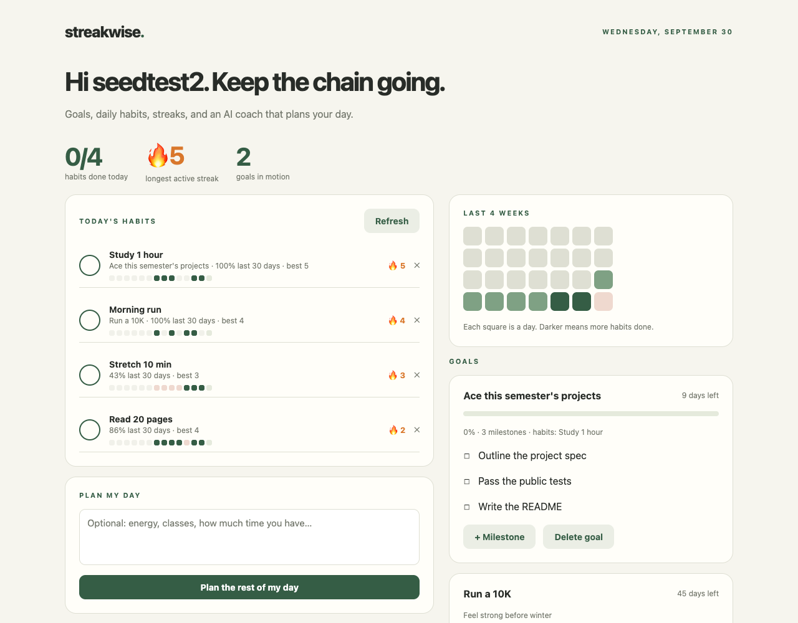
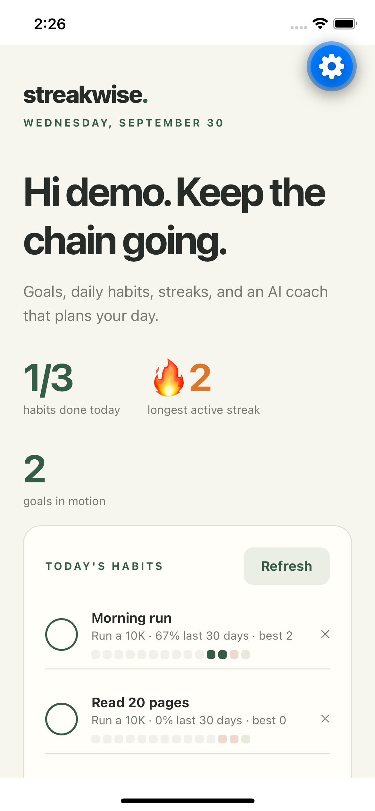

# Streakwise

**Chris Zhobro · UMID: `XXXXXXXX`**

Streakwise is a goals-and-habits planner written entirely in [Jac](https://jaclang.org).
You set goals and break them into milestones, attach small daily habits to them,
and check those habits off from whichever screen is closest: the web app on your laptop,
the native app on your phone, or one command in the terminal. Every check-in feeds
streaks, a 4-week heatmap and goal progress, and an AI coach turns today's open
habits and nearest deadlines into a time-blocked plan for the rest of your day.

| Web | iPhone (React Native) |
| --- | --- |
|  |  |

```text
$ jac run cli -- today
Wed 2026-09-30  ·  1/4 habits done  ·  longest streak 🔥5
   1. [ ] Study 1 hour  🔥5  → Ace this semester's projects
   2. [ ] Morning run  🔥4  → Run a 10K
   3. [ ] Read 20 pages  🔥2
   4. [x] Stretch 10 min  🔥4

Goals
  ░░░░░░░░░░   0%  Ace this semester's projects  9d left  next: Outline the project spec
  ███░░░░░░░  33%  Run a 10K  45d left  next: Run 8K
```

## Features

- **Habits on your own schedule.** Daily, weekdays, or any set of days (`mon,wed,fri`). Rest days never break a streak, and today's unchecked habit doesn't either until the day is over.
- **Streak math you can trust.** Current streak, best streak, 30-day completion rate, a 14-day history strip per habit, and a 28-day heatmap across all habits. Forgot to log yesterday? Backfill up to 7 days.
- **Goals with milestones.** Target dates with a days-left countdown, milestone checklists that drive a progress bar, and habits linked to the goal they support.
- **AI day planner.** "Plan my day" sends open habits (longest streaks first), goal deadlines and next steps, plus your free-text note ("class 2–4, low energy tonight"), to Claude through Jac's `by llm()`. The result is a typed `DayPlan` of time blocks starting from your current time. Without an API key, or if the model fails, it falls back to a rule-based plan, so the button always works.
- **Private accounts.** Each user's data lives on their own graph root. Every endpoint rejects anonymous callers, and tests show one user can't read or modify another's data.

## Setup

Prerequisites:

- **macOS or Linux** (Windows via WSL). Nothing else for the web app and CLI: the `jac` binary ships its own Python, Bun and package managers.
- **Jac 0.37.21.** Install that exact version: the current 0.37.23 macOS build has a packaging bug (fixed upstream in jaseci-labs/jac#9598, not yet released) that breaks `jac install`.

  ```bash
  curl -fsSL https://raw.githubusercontent.com/jaseci-labs/jaseci/main/scripts/install.sh | bash -s -- --version 0.37.21
  ```
  Then add `~/.local/bin` to your `PATH` as the installer prints, open a new terminal, and check that `jac --version` says `0.37.21`.
- **For the mobile app:** Xcode with an iOS Simulator (tested with Xcode 14.3 and iOS 16.4), or the free **Expo Go** app on an iPhone.
- **Optional, for AI plans:** an Anthropic API key in the server's environment.

## Run it

```bash
git clone <this repo> streakwise && cd streakwise
jac install          # first time only: Python and npm dependencies
jac run              # web app + server on http://localhost:8000
```

Open http://localhost:8000, click **New here? Create an account**, and you're in.
Data is stored under `.jac/` in the project folder and survives restarts.

To enable the AI planner, start the server with a key:

```bash
ANTHROPIC_API_KEY=sk-ant-... jac run
```

The model is set in `jac.toml` (`[byllm.model] default_model = "anthropic/claude-sonnet-5"`). AI plans are capped at 20 per account per day.

## CLI

With `jac run` going in another terminal, from the project folder:

```bash
jac run cli -- signup <username>     # or: login <username>
jac run cli -- seed-demo             # optional: fill an empty account with a sample week
jac run cli -- today                 # today's checklist + goal progress
jac run cli -- done run              # check in by (partial) name or number; run again to undo
jac run cli -- done read --date 2026-09-29   # backfill up to 7 days
jac run cli -- add-habit "Read 20 pages" --days weekdays --goal 10k
jac run cli -- add-goal "Run a 10K" --by 2026-11-15 --why "Feel strong before winter"
jac run cli -- step 10k "Run 8K"     # add a milestone to a goal
jac run cli -- tick 8k               # check off a milestone
jac run cli -- habits                # streaks + 14-day history for every habit
jac run cli -- week                  # 4-week heatmap
jac run cli -- plan "class 2-4pm, tired tonight"
jac run cli -- --help
```

The session token is saved to `~/.streakwise.json` (mode 600). Use `--url` or `PLANNER_URL` to point at another server.
Tip: `alias sw='jac run cli --'`, then `sw today`, `sw done run`.

## Mobile app

The mobile app is React Native (Expo) compiled from the same Jac UI. It connects to the `jac run` server.

**iOS Simulator (no phone needed):** with `jac run` going in one terminal, run in a second terminal:

```bash
./scripts/mobile-ios.sh
```

The script boots an iPhone simulator and starts Metro. When you see `Waiting on http://localhost:8081`, **press `i`**: Expo installs Expo Go in the simulator the first time and opens Streakwise. Keep the address `http://127.0.0.1:8000`, tap **Connect**, and sign in with the same account you use on the web and CLI. The first bundle takes a minute or two. If pressing `i` doesn't bring the app up, run `xcrun simctl openurl booted exp://127.0.0.1:8081` in another terminal.

**Real iPhone:** install Expo Go from the App Store, put the phone on the same Wi-Fi as your Mac, run `./scripts/mobile-ios.sh --phone`, and scan the QR code with the Camera app. In the app, connect to the `http://<your-mac-ip>:8000` address the script prints. (Some campus networks block device-to-device traffic; a phone hotspot works.)

The script also works around a Jac 0.37.21 bug: the first native compile leaves out a runtime file (`auth_contract.js`), so on a fresh checkout the bundle would fail with *Unable to resolve module ./auth_contract.js*. The script copies the identical file from the web build.

About the logs: Jac's mobile dev mode prints one `Client 'mobile' failed: Unsupported mobile platform 'web'` traceback. That's a helper process the script deliberately short-circuits (otherwise it would download the Android SDK). Metro and the app are unaffected.

## How the pieces fit together

```
                         ┌────────────────────────────────────────┐
  web.jac    ──┐         │  core/planner.jac   (service app)      │
  (browser)    │         │  Goal ─Supports→ Habit ─→ CheckIn      │
               ├─ shared │     └─→ Milestone        Profile       │
  mobile.jac ──┤ core/   │  10 typed endpoints, per-user roots    │
  (iOS/Expo)   │ ui.jac  │            │                           │
               │         │  core/coach.jac  by llm() → DayPlan    │
  cli.jac  ────┴─────────┤            (+ rule-based fallback)     │
  (terminal)   typed bridge calls      persisted graph in .jac/   │
                         └────────────────────────────────────────┘
```

- **Server:** [`core/planner.jac`](core/planner.jac) is a Jac service app. Goals, milestones, habits and check-ins are graph nodes on each user's root, joined by typed edges (`Goal -Supports-> Habit`), and Jac persists that graph automatically. All streak and heatmap math happens here once, so every client shows identical numbers. [`core/coach.jac`](core/coach.jac) holds the AI planner. Its helpers are `_`-prefixed so they are never exposed as HTTP endpoints.
- **One UI, two platforms:** [`core/ui.jac`](core/ui.jac) is written in Jac's mobUI primitives, which compile to React DOM for the web ([`web.jac`](web.jac)) and to native React Native views for the phone ([`mobile.jac`](mobile.jac)). The layout switches from one column to two at 860 px.
- **CLI:** [`cli.jac`](cli.jac) imports the very same typed functions (`dashboard`, `check_in`, `plan_day`, ...) that the UI calls. Jac turns those imports into authenticated HTTP bridge calls, so there's no hand-written REST client anywhere.
- **Config:** [`jac.toml`](jac.toml) declares the workspace apps (`web`, `mobile`, `desktop`, `cli`, and the `planner` service), with `default-app = "web"` so plain `jac run` serves the web app and the server together.

A typical day: plan the week and set goals on the web, check off habits on the phone,
`sw done read` from the terminal between builds, and hit **Plan my day** when the afternoon gets away from you.

## What makes it stand out

- **Four clients, one source of truth, verified end to end.** A check-in tapped in the iPhone app appears instantly in `jac run cli -- today` and on the web. The web and mobile UIs are literally the same Jac component.
- **AI that degrades gracefully.** The planner returns a typed `DayPlan` object, not free text. Habit IDs the model invents are discarded. Bad output, no key, or the daily cap all fall back to a deterministic plan. The note is treated as data (prompt-injection-aware) and truncated.
- **Security as a feature.** Per-user graph roots, a sign-in guard on every endpoint, internal helpers kept off the API, a per-account AI budget, and a session file readable only by its owner.
- **Tested.** `jac test` covers streak math on real calendars (rest days, open today, backfills), goal progress, input validation, cross-user isolation, the rule-based planner, and the AI path using a mocked model:

  ```bash
  JAC_TEST_JOBS=0 jac test     # all tests
  jac check                    # type-checks all 5 apps
  ```

## Project layout

```
jac.toml              workspace: apps, default app, AI model
core/planner.jac      server: data model, streak math, endpoints
core/coach.jac        AI day planner (byLLM) + rule-based fallback
core/ui.jac           shared web + mobile UI (mobUI)
core/theme.jac        colors and styles
core/*.test.jac       tests
web.jac  mobile.jac  desktop.jac  cli.jac    client entry points
scripts/mobile-ios.sh one-command iOS simulator / iPhone launcher
```

Scaffolded from Jac's `jac create --awetiny` example (web, mobile, CLI and service layout), with the social-feed code replaced by the planner.
